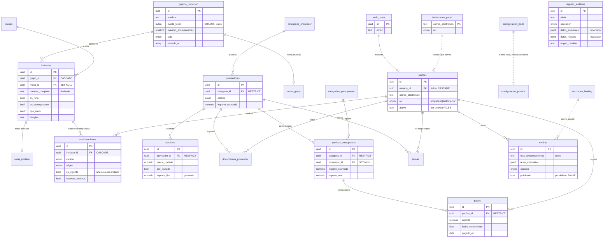

# Modelo de datos

> Esquema de la base de datos de la web de boda: PostgreSQL 17 sobre Supabase.
> Es documento vivo: **cualquier cambio de esquema se documenta en la misma PR
> que lo introduce**, junto a su migración y su SQL de rollback.

Las migraciones viven en [`supabase/migrations/`](../supabase/migrations/) y se
aplican en orden alfabético, que es el orden cronológico de su prefijo. Son
**50**, y las ocho primeras son las que levantan el esquema entero: quien quiera
entender la base las lee en orden y ya sabe cómo funciona. Las demás son
incrementales —una tabla, un enumerado, una columna— y cada una lleva en su
cabecera el ticket que la trajo y por qué está escrita así, que es donde de
verdad se explica cada decisión.

| Fichero                                 | Ticket            | Contenido                                                                          |
| --------------------------------------- | ----------------- | ---------------------------------------------------------------------------------- |
| `20260803090000_base.sql`               | BODA-10 · BODA-11 | Cierre de privilegios, extensiones, utilidades, auditoría, perfiles, configuración |
| `20260803090100_invitados.sql`          | BODA-12           | Grupos de invitación, invitados, confirmaciones                                    |
| `20260803090200_economia.sql`           | BODA-13           | Proveedores, servicios, presupuesto, pagos                                         |
| `20260803090300_organizacion.sql`       | BODA-13           | Tareas, mesas, medios y cableado de la auditoría                                   |
| `20260803090400_rls.sql`                | BODA-14           | Funciones de rol, privilegios, políticas RLS, `force`                              |
| `20260803090500_funciones_publicas.sql` | BODA-14           | RSVP público y emisión de enlaces                                                  |
| `20260803090600_vistas.sql`             | BODA-14           | Vistas de lectura y barrido final de permisos                                      |
| `20260803090700_arranque.sql`           | BODA-10           | Arranque en frío del primer propietario                                            |

Cada una tiene su reverso exacto en
[`supabase/migrations/rollback/`](../supabase/migrations/rollback/), con el mismo
nombre. Se ejecutan en orden **inverso**.

En números: **37 tablas, 15 vistas, 20 enumerados, 54 funciones, 72 políticas RLS.**

Esos cinco números no se escriben a mano: los cuenta la suite de seguridad contra
el catálogo de la base recién migrada, y si el documento dice otra cosa, el CI se
pone rojo. Se quedaron en «24 tablas» durante trece tablas, que es lo que pasa
con un número copiado a mano en un documento que se lee más de lo que se edita.

Todo esto no se da por bueno leyéndolo: `./scripts/probar-bbdd.sh` levanta un
PostgreSQL desechable, aplica las migraciones desde cero y ejecuta
[la suite de seguridad](../supabase/tests/seguridad.sql) — **más de 110
comprobaciones** que atacan la base como un intruso. Corre en CI y es bloqueante,
y el script exige tanto el sello del final como ese suelo: una suite que se corta
a la mitad sale con cero y en verde si nadie lo mira.

### El arranque en frío

`perfiles.activo` nace en `false` y el trigger `proteger_privilegios_perfil`
exige un propietario activo para activar a nadie. En una base recién desplegada
no hay ninguno, así que el candado se cierra sobre sí mismo: **nadie podría
entrar jamás**. Se detectó ejecutando el flujo completo contra un Postgres real;
ninguna lectura del SQL lo habría visto, porque cada pieza es correcta por
separado.

Lo resuelve `designar_primer_propietario(usuario_id, nombre)`, que solo puede
ejecutar `service_role`, se niega a actuar si ya existe un propietario activo, y
por tanto no sirve como puerta trasera más adelante.

---

## 1. Convenciones

Estas reglas se aplican sin excepción. Si algo del esquema no las cumple, es un
error, no un caso especial.

- **Todo en castellano.** Tablas, columnas, tipos, valores de enumerado,
  funciones, índices y restricciones. Sólo son inglesas las palabras reservadas
  de SQL. Se admiten como préstamos técnicos ya asentados: `id` (identificador),
  `token`, `hashtag`, y los acrónimos `RSVP`, `IBAN`, `MIME`, `URL`, `BCP 47`,
  `ISO 4217`. Donde había alternativa castellana natural se ha usado: la huella
  criptográfica del token es `huella_token`, no `token_hash`; el marcador borroso
  de una imagen es `marcador_borroso`, no `blur_hash`; el correo es
  `correo_electronico`, no `email`.
- **Nombres.** Restricciones `<tabla>_<detalle>`; claves foráneas
  `<tabla>_<columna>_fk`; índices `<tabla>_<detalle>_idx`; políticas
  `<tabla>_<quién>_<qué>`. Una sola convención en todo el esquema.
- **Toda tabla** lleva `id uuid` (salvo las de fila única por clave natural),
  `creado_en` y `actualizado_en`.
- **`actualizado_en`** lo sella siempre el mismo trigger,
  `public.fijar_actualizado_en()`, y siempre con la misma condición
  `when (old.* is distinct from new.*)`. Significa lo mismo en todas las tablas:
  «cuándo cambió algo de verdad». Un UPDATE que no cambia nada no la mueve.
- **RLS se activa en la sentencia inmediatamente posterior al `CREATE TABLE`**,
  antes de índices, comentarios y triggers. Nunca existe una tabla, ni un
  instante, sin RLS.
- **Cero hardcode.** Lo que puede cambiar sin que cambie la lógica es
  configuración y vive en una tabla: los datos de la boda, las secciones de la
  landing, los límites del cortafuegos, los campos que la auditoría redacta.
- **Errores con código estable.** Los triggers y funciones lanzan códigos
  (`RSV03`, `CNF01`, `PRF01`, `MED01`…), nunca texto visible: el copy vive en
  `content/copy.es.json`. Los identificadores internos viajan en `DETAIL`, que
  PostgREST no devuelve al cliente, para no convertir un error en un oráculo de
  existencia de uuids ajenos.

---

## 2. Diagrama de relaciones



### Qué pasa al borrar

El criterio no es uniforme, y la diferencia es deliberada:

| Borras…               | …y se lleva por delante                            | …y sobrevive                                                                   |
| --------------------- | -------------------------------------------------- | ------------------------------------------------------------------------------ |
| Un grupo              | sus invitados y sus confirmaciones (`CASCADE`)     | la entrada de auditoría, con los datos para reconstruirlo                      |
| Un invitado           | su historial de respuestas (`CASCADE`, RGPD)       | la auditoría                                                                   |
| Una mesa              | nada: sus invitados quedan «sin mesa» (`SET NULL`) | todo el reparto                                                                |
| Un colaborador        | nada: autorías a NULL (`SET NULL`)                 | tareas, pagos, documentos, medios y toda la traza de auditoría                 |
| Un proveedor          | **nada**: `RESTRICT`                               | facturas, contratos y servicios — son contabilidad, hay que resolverlos a mano |
| Una categoría         | **nada**: `RESTRICT`                               | obliga a recategorizar antes                                                   |
| Una partida con pagos | **nada**: `RESTRICT`                               | el histórico de pagos                                                          |
| La configuración      | **nada**: un trigger lo impide (`CFG01`)           | la boda sigue teniendo fecha                                                   |

---

## 3. Las entidades

### 3.1 Configuración y acceso

#### `configuracion_boda` — fila única, **pública entera**

Fecha, nombres, lugares, coordenadas, hashtag, moneda, idioma, plazo de RSVP.

Está separada de la parte privada **por diseño**: la landing necesita leerla y
RLS filtra filas, no columnas. Como aquí sólo hay una fila, una política de
lectura pública expone la fila completa — así que en esta tabla no puede haber
nada que no sea publicable. La restricción de fila única es declarativa
(`fila_unica boolean check (fila_unica) unique`) y no un trigger: una
restricción no se esquiva. La fila la siembra la migración y **no se puede
borrar**.

#### `configuracion_privada` — fila única, **nunca sale del panel**

`presupuesto_objetivo`, `aforo_maximo`, `telefono_contacto`, `iban_regalos`,
`notas_privadas`. Lectura para editor y propietario; escritura sólo propietario.

**La única salida es `datos_para_regalos()`**, que publica el IBAN y su titular
—y nada más— cuando la sección `regalos` está visible. Desde BODA-129 los dos se
escriben en Ajustes, en su propio formulario: un editor cambia la hora de la
ceremonia y **no** la cuenta corriente, y con un solo botón de guardar o se le
niega todo lo demás o se le cuela el número de cuenta. Ese «no» es el silencio
de RLS —cero filas y ningún error—, así que la acción cuenta las filas tocadas
para poder decirlo.

#### `secciones_landing`

Qué secciones se enseñan y en qué orden (`seccion` PK, `visible`, `orden`).
Sustituye a los antiguos nueve flags `mostrar_*`, que formaban un vocabulario
paralelo al del enumerado de secciones y obligaban al frontend a traducir
nombres a mano. Ahora hay **una sola lista**: el enumerado `seccion_landing`.

#### `invitaciones_panel`

Lista blanca de correos autorizados a entrar en el panel, con el rol que se les
concede. **Es la pieza que hace que registrarse no conceda nada.**

#### `perfiles`

Extiende `auth.users`. `rol` (`propietario`/`editor`/`lector`) y `activo`
—**por defecto `false`**—. El correo se copia desde `auth.users` por trigger,
con índice **no único**: `auth.users` ya garantiza su unicidad, y un choque aquí
abortaría el alta de la cuenta con un 500 opaco.

#### `registro_auditoria` y `campos_auditoria_redactados`

Bitácora de quién cambió qué y cuándo. Está enganchada a **las 20 tablas de
dominio**, no a dos: los triggers de fila también se disparan en los borrados en
cascada, así que un grupo borrado por error se puede reconstruir entero.

`campos_auditoria_redactados` es una **tabla** y no una lista dentro de la
función: declarar un campo sensible es configuración, no debe exigir migración.
Los valores de esas columnas se sustituyen por un marcador antes de escribirlos.
La clave se conserva, y `campos_modificados` se calcula **antes** de redactar, de
modo que un cambio de token consta aunque su valor no se guarde.

`origen_cambio` distingue `panel`, `sistema` y `rsvp:<grupo>`. Sin él, todo lo
que entra por una función pública llamada con la clave anónima aparecería como
cambio del sistema, porque ahí `auth.uid()` es `NULL`.

### 3.2 Invitados

#### `grupos_invitacion`

La unidad de invitación: una familia o una pareja.

- **`huella_token bytea`** — el SHA-256 del token. El texto plano **no se
  almacena**: existe una sola vez, como valor devuelto por
  `crear_grupo_invitacion()` o `rotar_token_invitacion()`. Si se pierde, se emite
  otro; rotar invalida el anterior en el acto, así que también sirve para
  revocar un enlace filtrado.
- **`invitado_a`** — array de eventos, normalizado por trigger (sin duplicados y
  ordenado). El CHECK no fija el número de eventos: ese dato es derivable del
  enumerado y copiarlo obligaría a tocar la restricción al añadir uno nuevo.
- **`invitado_a`, `maximo_acompanantes`, `lado` y `huella_token` son
  privilegios, no datos**: definen a cuántos eventos entra el grupo y cuánta
  gente puede añadir. Un trigger los congela frente a cualquiera que no sea
  editor (`RSV06`).

#### `notas_grupo` y `notas_invitado`

Notas privadas de los novios, en tablas aparte. La ruta pública del RSVP tiene
que leer `grupos_invitacion` e `invitados`; **lo que el invitado no debe ver,
sencillamente no está en la tabla que se le devuelve.** Ninguna función pública
las toca, y llevan RLS forzada.

#### `invitados`

- `nombre_completo` es columna real mantenida por trigger, no `GENERATED`:
  PostgreSQL prohíbe `when (old.* is distinct from new.*)` en un trigger BEFORE
  de una tabla con columnas generadas, y sin esa cláusula esta tabla —y sólo
  ella— movería `actualizado_en` en UPDATEs que no cambian nada.
- **El menú infantil es una implicación, no una equivalencia**:
  `check (tipo_menu <> 'infantil' or es_nino)`. La equivalencia estricta hacía
  imposible registrar a un niño celíaco, vegano o vegetariano — el único caso en
  que la exactitud del dato importa de verdad. El recuento de niños se hace por
  `es_nino`, que es el dato fiable.
- El tope de acompañantes lo garantiza un _constraint trigger_ que **bloquea la
  fila del grupo** antes de contar. Contarlo en la aplicación deja una carrera
  ganable: en READ COMMITTED, treinta llamadas concurrentes leen todas
  `count(*) = 0` y todas insertan.

#### `confirmaciones` — histórico de sólo inserción

Una fila por respuesta. La anterior deja de ser vigente; nunca se edita.

- `es_vigente` con índice único parcial garantiza **como mucho** una vigente por
  persona; un _constraint trigger_ diferido garantiza **al menos** una. Sin el
  segundo, un invitado sin fila vigente desaparece en silencio del recuento de
  confirmados, del reparto de menús y de la lista del autobús: ningún error,
  sólo números que no cuadran.
- La inmutabilidad se comprueba **por sustracción**
  (`to_jsonb(new) - 'es_vigente' - 'actualizado_en'`), no con una lista cerrada
  de columnas: así cubre `id`, `creado_en` y toda columna futura sin que nadie
  tenga que acordarse de ampliarla. Reordenar `creado_en` era reordenar la
  cronología de quién dijo qué y cuándo, que es lo único que esta tabla existe
  para probar.
- `origen` tiene por defecto `publico`, **el valor menos fiable**. Con `panel`
  por defecto, un INSERT que se olvidara de fijarlo quedaría registrado como si
  lo hubiera tecleado un novio. Un CHECK ata origen y autoría:
  `panel` ⇔ `registrado_por is not null`.
- `respondido_en` lo sella el servidor en el origen público, y nunca puede estar
  en el futuro.

- `canciones_sugeridas` — `aprobada` por defecto `true` y es la propia política
  de lectura pública la que filtra por ese booleano: **la moderación es a
  posteriori**, y desmarcarla retira la sugerencia de la web sin borrarla.
  `grupo_id` va con `on delete set null` y no en cascada: es rastro por si hay
  que retirar algo, y la canción sobrevive al grupo que la propuso. `anon` sólo
  tiene SELECT sobre la tabla; se escribe por `sugerir_cancion()`, que exige
  token de invitación válido, corta a diez canciones por grupo y devuelve la que
  ya estaba si el grupo repite la misma (índice único parcial sobre
  `(grupo_id, lower(btrim(texto)))`): reeditar la respuesta no la apunta dos veces.

- `mensajes_leidos` — qué mensajes de invitados se han leído y quién, en tabla
  aparte porque **`confirmaciones` es inmutable por diseño**: el trigger
  `confirmaciones_inmutables` compara la fila entera menos `es_vigente` y
  `actualizado_en`, así que una columna nueva allí caería bajo esa protección y
  marcar como leído fallaría con `CNF01`. La clave primaria es sólo
  `confirmacion_id` —un mensaje se lee o no se lee— y `leido_por` es dato: que
  lo abra uno de los novios no lo deja sin leer para el otro. Las dos claves
  foráneas borran en cascada y `anon` no tiene ningún privilegio: la bandeja es
  del panel.

### 3.3 Economía

`categorias_proveedor` → `proveedores` → `servicios` / `documentos_proveedor`;
`categorias_presupuesto` → `partidas_presupuesto` → `pagos`.

- **Documentos y servicios usan `RESTRICT`, no `CASCADE`.** Facturas y contratos
  son documentación contable: no pueden desaparecer porque alguien pulse
  «Borrar» en la ficha del fotógrafo en vez de marcarlo como descartado. Además,
  tras una cascada la aplicación ya no ve esas filas y los objetos quedarían
  huérfanos para siempre en el bucket de Storage, sin nada que los referencie.
- `servicios.por_invitado` marca los precios que dependen de los confirmados.
  `importe_fijo` es una columna generada que vale `NULL` justamente en esos
  casos, para que nadie la confunda con un total real; el total lo da
  `v_servicios_importe`.
- Las rutas de Storage (`documentos_proveedor`, `pagos`, `medios`) se validan
  todas con la misma función: sin barra inicial, sin `..`, y **admitiendo
  mayúsculas** — `galeria/DSC_0001.JPG` es una clave legal y habitual, y
  rechazarla dejaba ficheros huérfanos en el bucket con un error que el usuario
  no podía corregir.

- `contactos_proveedor` — el comercial que firma el contrato casi nunca es quien
  está el día de la boda, así que un proveedor admite varios contactos y las tres
  columnas de contacto de `proveedores` se quedan como el principal: esta tabla es
  **«además de», no «en vez de»**. Borra en cascada con el proveedor, al revés que
  el resto de esta parte del esquema: un contacto no es contabilidad, y con
  `restrict` habría que vaciarlos a mano antes de poder borrar a nadie.
  `contactos_proveedor_alguna_via` exige correo o teléfono, porque un nombre al que
  no se puede llamar no ordena la agenda del día.

### 3.4 Organización

- `tareas` — `completada_en` lo mantiene un trigger a partir de `estado`, con un
  CHECK que exige la equivalencia. No hay tareas reabiertas con fecha de cierre
  zombi.
- `mesas` — capacidad acotada a 1..30 (red contra el dedazo, no regla de
  producto) y posición completa o ausente: media coordenada rompería el plano.
- `medios` — `publicado` por defecto `false`. El texto alternativo es obligatorio
  **en el idioma por defecto de la boda**, que se lee de `configuracion_boda` en
  un trigger en vez de fijar `'es'` en un CHECK: si los novios cambian el idioma,
  la restricción de accesibilidad tiene que seguir protegiendo el idioma que
  realmente se sirve.

- `guion_dia` — el guion interno de la jornada, en tabla aparte de
  `hitos_programa` porque aquello es contenido público de la landing y esto lleva
  quién responde de cada cosa. `hora` es texto y no `time`: en una boda se escribe
  «13:15» pero también «al acabar el cóctel», así que **el orden lo manda `orden`
  y no la hora**. `responsable` es texto libre y no una clave a `perfiles` —la
  coordinadora de la finca no tendrá cuenta nunca—, y `hecho_en` es marca de
  tiempo y no booleano, porque «hecho a las 13:22» reconstruye el día y «hecho» a
  secas no.

- `correcciones_recuento` — el primo que avisa a las diez de que no llega no ha
  rechazado nada: su confirmación es historia y `confirmaciones` es inmutable, así
  que el ajuste vive en su propia tabla y **no reescribe el RSVP**. `ajuste` es un
  entero con signo acotado a -500..500 —puede ser negativo, que es justo el caso
  que justifica la tabla— y `tipo_menu` es único: dos filas del mismo menú serían
  dos verdades que alguien tendría que sumar la víspera. El total se lo da al
  catering `v_recuento_catering`, con `full join` sobre `v_menus_confirmados` para
  que no se caiga ni una corrección sin confirmados ni un menú sin corrección.

- `plantilla_tareas` — guarda la **antelación en días** y no una fecha:
  `generar_tareas_desde_plantilla` la calcula contra `configuracion_boda`, así que
  la misma plantilla vale para cualquier boda. Lo que hace idempotente esa
  generación es `tareas.plantilla_id`, con índice único parcial —una fila de
  plantilla produce como mucho una tarea— y `on delete set null`, que borra el
  rastro sin llevarse la tarea ya creada. `grupo` es texto y no enumerado porque
  añadir un juego de tareas debe ser una fila, no una migración.

- `documentos_boda` — el expediente civil caduca, así que `estado` y `obtenido_en`
  van atados por un CHECK bicondicional: `conseguido` exige fecha de obtención y
  cualquier otro estado la prohíbe, para que deshacer un «conseguido» puesto por
  error no deje colgando un «se recogió el martes». `caduca_en` admite `NULL` como
  «no caduca» —el libro de familia no caduca y el empadronamiento sí—, y **la
  comparación con el día de la boda la hace la base**: `v_documentos_boda` lee
  `configuracion_boda` y lleva la hora de la ceremonia a su zona horaria antes de
  quedarse con la fecha, nunca el reloj del navegador. El orden de
  `estado_documento_boda` no es alfabético a propósito: define el `<` del tipo y
  con él el de los listados, de modo que lo pendiente sale primero.

### 3.5 Contenido de la landing

Seis tablas con la misma forma —`orden`, `publicado`, `creado_en`— y el mismo
modelo: **`anon` lee lo publicado y nadie más toca nada**. Es la única excepción
consciente al «anon no lee ninguna tabla», y está acotada por la propia política:
el filtro es `publicado`, así que un borrador subido y sin revisar no sale por
pedir la tabla entera con la clave pública. Escribir sigue exigiendo
`puede_editar()`.

Son tablas y no textos en `copy.es.json` porque esto es contenido DE ESTA BODA y
lo escriben los novios desde el panel, sin desplegar.

- `hitos_programa` — la hora es `text` y no `time` a propósito: en una boda se escribe
  «14:00», «sobre las 19:30» o «de madrugada», y un tipo horario obligaría a inventar
  convenciones para lo aproximado. La preboda no trajo tabla nueva sino la columna
  `momento` (`preboda`/`boda`), con `boda` por defecto para que las filas que ya
  existían no cambiaran de significado: **dos tablas idénticas se acaban separando en
  cuanto una gana una columna que la otra no**.

- `hitos_historia` — `fecha_texto` es texto y opcional: la historia de una pareja se
  cuenta con «verano de 2016» o «el segundo viaje», no con fechas de calendario.
  Comparte con `alojamientos` la foto opcional en `medio_id`, con `ON DELETE SET NULL`
  por el mismo motivo.

- `preguntas_frecuentes` — pregunta y respuesta son obligatorias y ninguna puede quedar
  en blanco: una fila a medias se publica igual que una entera, y lo que se ve es la
  pregunta sin responder. `publicado` nace en `true` en las seis tablas de esta sección
  —al revés que en `medios`—: aquí el borrador es la fila que todavía no se ha escrito.

- `consejos_vestimenta` — el dress code es contenido de esta boda y no copy fijo —el
  consejo sobre los tacones sale de conocer el suelo de la finca— y tiene la misma forma
  que `preguntas_frecuentes`, así que es otra tabla y no un texto en `copy.es.json`. La
  siembra de la migración se protege con `where not exists` sobre la tabla entera, no
  con `on conflict`: no hay clave natural, y así se puede reaplicar sin duplicar los
  consejos ni pisar lo que hayan editado los novios.

- `alojamientos` — `precio_texto` es texto libre y no `numeric`: un hotel comunica
  «135 € / noche» o «desde 90 €», y un número obligaría a decidir impuestos y régimen.
  La foto es opcional y se desengancha sola —`medio_id` con `ON DELETE SET NULL`—,
  porque borrar una imagen de la galería no puede llevarse por delante el hotel.
  `url_reserva` admite NULL, pero si viene tiene que empezar por `http://` o `https://`.

- `rutas_llegada` — la tabla más sosa de la sección, y está bien que lo sea: sólo `modo`
  es obligatorio, y `duracion` y `detalle` son texto opcional porque «unos 25 minutos
  desde León» no es un intervalo que nadie vaya a calcular. Aquí y en sus cinco hermanas
  está **la excepción consciente al «anon no lee nada»**: `anon` tiene SELECT filtrado
  por `publicado`, y escribir sigue pasando por `puede_editar()`.

### 3.6 Seguridad del RSVP

- `parametros_seguridad` — fila única con los límites del cortafuegos
  (intentos, ventana, retención). Son configuración: se ajustan sin migración.
- `intentos_rsvp` — intentos de resolver un token. Guarda la **huella** del token
  intentado, nunca el token: la bitácora de seguridad no puede convertirse en un
  almacén de credenciales.

---

## 4. Vistas

Todas con `security_invoker = on` y **columnas enumeradas una a una**.

En PostgreSQL una vista se ejecuta con los privilegios de su propietario salvo
que se diga lo contrario; en Supabase ese propietario es `postgres`, dueño de
todas las tablas, de modo que una vista normal **ignora toda la RLS**.
`v_resumen_presupuesto` cruza por definición categorías, partidas, pagos y
proveedores: es exactamente el agregado que un atacante quiere. Con
`security_invoker`, quien consulta pasa por sus propias políticas y un atacante
recibe cero filas.

El `select *` está prohibido por el mismo motivo que en las funciones públicas:
con el asterisco, cualquier `add column` futuro se publica solo y en silencio.
Las vistas **materializadas** están prohibidas sobre estas tablas: no admiten
`security_invoker` en absoluto.

| Vista                      | Quién la ve   | Para qué                                             |
| -------------------------- | ------------- | ---------------------------------------------------- |
| `v_configuracion_publica`  | `anon`        | Datos de la boda para la landing                     |
| `v_secciones_publicas`     | `anon`        | Secciones visibles, en orden                         |
| `v_medios_publicados`      | `anon`        | Fotos publicadas por sección                         |
| `v_estadisticas_invitados` | colaboradores | Confirmados, adultos, niños, autobús, alojamiento    |
| `v_menus_confirmados`      | colaboradores | Recuento de menús para el catering                   |
| `v_servicios_importe`      | colaboradores | Importe real, resolviendo el precio por invitado     |
| `v_resumen_presupuesto`    | colaboradores | Previsto vs estimado vs real vs pagado, y desviación |
| `v_proximos_pagos`         | colaboradores | Qué hay que pagar y cuándo                           |

`v_servicios_importe` existe para que la fórmula del coste por invitado viva en
la base de datos y no replicada en TypeScript: si mañana se decide contar a los
niños a media tarifa, se cambia aquí y el panel entero se entera.

---

## 5. Modelo de seguridad

> La seguridad vive en la base de datos. Ni una sola de las garantías de esta
> sección depende de una casilla de un dashboard, de un `if` del frontend ni de
> que una función de aplicación se acuerde de comprobar algo.

### 5.1 Los privilegios parten de cero

Supabase deja puesto `alter default privileges ... grant all on tables to anon,
authenticated`: en el instante del `CREATE TABLE`, `anon` ya tiene SELECT,
INSERT, UPDATE, DELETE y **TRUNCATE** sobre la tabla, y lo único que lo tapa es
RLS — que **no se aplica a TRUNCATE**.

La primera migración revoca esos privilegios por defecto **antes de crear la
primera tabla**, de modo que ninguna tabla del proyecto nace concedida. Después
se conceden uno a uno, enumerando siempre las operaciones (nunca `all`, para que
TRUNCATE no entre por la puerta de atrás).

### 5.2 Qué ve cada quién

| Rol                     | Lectura                                                                                                | Escritura                                                                                              |
| ----------------------- | ------------------------------------------------------------------------------------------------------ | ------------------------------------------------------------------------------------------------------ |
| **`anon`** (la landing) | `configuracion_boda`, `secciones_landing` visibles, `medios` publicados, y las tres vistas públicas    | **nada**                                                                                               |
| **`anon`** (con token)  | Su invitación, vía `obtener_invitacion()`; los correos de su grupo, vía `destinatarios_confirmacion()` | Su RSVP, vía `registrar_confirmacion()` y `anadir_acompanante()`; la playlist, vía `sugerir_cancion()` |
| **`lector`**            | Todo el dominio: invitados, confirmaciones, economía, tareas, mesas, medios                            | nada                                                                                                   |
| **`editor`**            | Lo anterior + notas privadas + `configuracion_privada`                                                 | Todo el dominio; en `confirmaciones` sólo INSERT                                                       |
| **`propietario`**       | Todo, incluida la bitácora de auditoría y la lista blanca                                              | Todo, incluidos usuarios y configuración privada                                                       |

Nadie —ningún rol, en ninguna circunstancia— tiene UPDATE ni DELETE sobre
`confirmaciones` ni sobre `registro_auditoria`. Un histórico que se puede editar
no es un histórico.

### 5.3 Registrarse no concede nada

Un alta en `auth.users` dispara un trigger que crea el perfil **inactivo y con
rol `lector`**, salvo que el correo figure en `invitaciones_panel`. Todas las
funciones de rol (`puede_leer`, `puede_editar`, `es_propietario`) exigen
`activo`.

Consecuencia práctica: **el registro público de Supabase puede quedarse
activado sin riesgo.** Quien se fabrique una cuenta con la clave anónima obtiene
una sesión válida que no puede leer absolutamente nada. La defensa es una tabla
versionada y testeada, no una casilla de un panel que nadie versiona y cualquiera
puede volver a activar.

El trigger además captura sus propios errores: un fallo sincronizando el perfil
no puede abortar la transacción de Supabase Auth y dejar al usuario con un 500.

### 5.4 El primer propietario (arranque en frío)

Una base recién desplegada **no tiene ningún colaborador activo**, y
`invitaciones_panel` sólo la puede gestionar un `propietario`. La primera fila,
por tanto, no puede entrar por la API: es un acto deliberado, fuera de banda, y
está bien que lo sea.

Se hace una sola vez, desde el editor SQL de Supabase o con la clave
`service_role` (ambos con `bypassrls`). Lo hace por ti
`scripts/dar-acceso-al-panel.sh`, que sin `DATABASE_URL` imprime el SQL listo
para pegar:

```sql
insert into public.invitaciones_panel (correo_electronico, rol)
values ('novia@sudominio.es', 'propietario'),
       ('novio@sudominio.es', 'propietario')
on conflict (correo_electronico) do update set rol = excluded.rol;
```

**El orden ya no importa (BODA-127).** Si la cuenta todavía no existe, el
trigger `auth_users_sincronizar_perfil` la creará **activa y con su rol** en el
propio INSERT del perfil. Si ya existía, el trigger `invitaciones_panel_aplicar`
pone ese perfil al día en el acto.

Hasta ese ticket sólo funcionaba el primer caso, y el segundo dejaba a la
persona **inactiva para siempre**: el `on conflict` del trigger de alta se niega
—con razón— a reevaluar privilegios, y el único arreglo posible, un UPDATE sobre
`perfiles`, lo cortaba `proteger_privilegios_perfil`. Le pasó a los novios en
producción, y desde fuera se veía como «el botón de acceso no funciona»: la
puerta respondía «el correo o la contraseña no son correctos».

Deliberadamente **no se siembra ningún propietario en las migraciones**: un
correo de los novios incrustado en un fichero versionado sería un dato real de
la boda dentro del código, justo lo que prohíbe la regla 1.

### 5.5 Nadie se asciende a sí mismo

`rol` y `activo` viven en la misma fila que el usuario edita para cambiarse el
nombre. Sin protección, «editar mi perfil» y «hacerme propietario» son la misma
operación. Hay dos defensas independientes:

1. Un trigger (`PRF01`) que rechaza cualquier cambio de `rol`, `activo` o
   `usuario_id` que no venga de un propietario activo.
2. El `with check` de la política de autoedición, que congela ambas columnas.

El trigger admite dos excepciones, las dos acotadas y ninguna alcanzable con una
sesión: el testigo del arranque en frío (`designar_primer_propietario`) y el
cambio que se limita a poner el perfil **de acuerdo con su fila de
`invitaciones_panel`** — misma cuenta, `activo` a cierto y el rol exacto que
concede la lista. La segunda no la puede usar un `authenticated` ni para sí
mismo, porque la defensa 2 le congela las dos columnas antes de llegar al
trigger; la suite de seguridad lo comprueba retirándole el acceso a alguien que
sigue invitado y viendo que no puede reactivarse.

Las funciones que la política consulta son `SECURITY DEFINER` a propósito: una
política sobre `perfiles` que leyera `perfiles` provocaría recursión infinita.

### 5.6 `force row level security`

`enable row level security` **no se aplica al propietario de la tabla**, que en
Supabase es también el propietario de las funciones `SECURITY DEFINER`. Sin
`force`, dentro de cualquier función definer —presente o futura— la RLS está
sencillamente desactivada.

Se fuerza en **27 de 37 tablas**. Las 10 excepciones no son olvidos; cada una
existe porque la maquinaria interna necesita tocarla como propietario:

| Tabla                                               | Por qué no se fuerza                                                                    |
| --------------------------------------------------- | --------------------------------------------------------------------------------------- |
| `perfiles`, `invitaciones_panel`                    | Las leen las funciones de rol y el trigger de alta, que corren antes de que haya sesión |
| `registro_auditoria`, `campos_auditoria_redactados` | Las usa el trigger de auditoría                                                         |
| `configuracion_boda`                                | Es pública entera; la leen los triggers de plazo y accesibilidad                        |
| `parametros_seguridad`, `intentos_rsvp`             | Las usa el cortafuegos del RSVP                                                         |
| `grupos_invitacion`, `invitados`, `confirmaciones`  | Las recorren las funciones públicas del RSVP                                            |

**La compensación por esas tres últimas está en cómo está escrito el SQL de las
funciones públicas**, y es una regla de revisión, no una recomendación:

- Ninguna función declara `returns setof <tabla>` ni usa `select *`. El tipo de
  retorno se enumera columna a columna, de modo que añadir mañana una columna
  sensible a `invitados` no la publica sola.
- **`invitado_id` nunca se acepta como dato de entrada suelto**: se deriva del
  token _dentro de la misma sentencia_ que lee o escribe. Un identificador ajeno
  no produce un error, produce cero filas — no hay ventana entre comprobar y
  escribir.
- Prohibido `jsonb_populate_record` contra el tipo de una tabla completa: se
  enumeran los campos que el invitado puede escribir, y `origen`,
  `registrado_por`, `respondido_en` y `es_vigente` los fija el servidor.
- El plazo se comprueba siempre contra `now()`, jamás contra una fecha recibida.

### 5.7 Cómo funciona el RSVP por token

```
El invitado recibe   https://…/rsvp/<token de 32 caracteres>
                     └─ 192 bits de entropía, base64 url-safe

  1. obtener_invitacion(token)
       ├─ cortafuegos: ¿demasiados intentos fallidos desde este origen? → RSV02
       ├─ busca por SHA-256 del token (la tabla no guarda el token en claro)
       ├─ anota el intento en intentos_rsvp
       └─ devuelve SOLO su grupo y sus personas, con columnas enumeradas:
          nada de notas privadas, nada de la dirección de otros, nada del token

  2. registrar_confirmacion(token, respuestas)
       ├─ mismo cortafuegos y misma resolución por huella
       ├─ INSERT ... FROM jsonb_array_elements JOIN invitados JOIN grupo del token
       │    → un invitado_id de otro grupo no casa: 0 filas
       ├─ si insertadas ≠ recibidas → RSV04 y se deshace TODO
       └─ triggers: plazo (RSV03), sellado de fecha (RSV07), vigencia

  3. anadir_acompanante(token, …)
       └─ constraint trigger con bloqueo del grupo → RSV05 si se agota el cupo
```

**Un enlace no válido no lanza excepción: devuelve vacío.** No es un capricho de
estilo. El cortafuegos cuenta los intentos fallidos guardándolos en
`intentos_rsvp`; si al detectar un token inválido la función lanzara una
excepción, PostgREST abortaría la transacción y ese INSERT se iría con ella. La
bitácora sólo acabaría conteniendo intentos con **éxito** y el límite no saltaría
jamás. Se comprobó sobre la base real: quince intentos fallidos seguidos dejaban
cero filas registradas. PostgreSQL no tiene transacciones autónomas, así que la
única forma de que el registro sobreviva es no abortar.

Contrato resultante, que el frontend debe respetar:

| Función                      | Enlace no válido |
| ---------------------------- | ---------------- |
| `obtener_invitacion`         | cero filas       |
| `registrar_confirmacion`     | devuelve `0`     |
| `anadir_acompanante`         | devuelve `NULL`  |
| `sugerir_cancion`            | devuelve `NULL`  |
| `destinatarios_confirmacion` | cero filas       |

Las cinco pasan por `exigir_cupo_rsvp()` y anotan el intento con
`registrar_intento_rsvp()`. `sugerir_cancion` lanzaba `CAN02` hasta la migración
`20260919200000`, y la excepción se llevaba el registro con ella: se reprodujo
—dos llamadas con un token inventado, cero intentos— y se corrigió. Y
`anadir_acompanante` aplica el plazo (`RSV03`) igual que el trigger de
`confirmaciones`: la fila inicial del acompañante nace con `origen = 'sistema'`,
que es justo lo que ese trigger deja pasar, así que la función lo mira antes de
escribir.

### 5.8 Sólo seis funciones son públicas

`obtener_invitacion`, `registrar_confirmacion`, `anadir_acompanante`,
`sugerir_cancion`, `destinatarios_confirmacion` y `datos_para_regalos`. Ninguna
más, y la lista es cerrada en los dos sentidos: `supabase/tests/seguridad.sql`
falla si `anon` puede ejecutar una que no esté aquí **y** si alguna de estas
seis deja de existir o de poder ejecutarla.

Conseguirlo exigió entender un detalle de PostgreSQL que durante meses se
atribuyó a Supabase: **`alter default privileges in schema public revoke execute
on functions from public` es un no-op.** Los privilegios por defecto «in schema»
se guardan como un delta sobre el default global, y revocar sobre un delta vacío
deja un delta vacío: no se almacena nada (`pg_default_acl` tenía cero filas) y
no retira el EXECUTE cableado para PUBLIC, del que `anon` hereda. Toda función
nueva seguía naciendo ejecutable por RPC, sin ningún error que lo delatara, y
así se escapó `avisos_programa_validos()`.

La forma **global**, sin `in schema`, sí se guarda y sí funciona: desde la
migración `20260919200000` una función creada sin ningún `grant` nace sin
EXECUTE para nadie salvo su dueño, y la suite lo comprueba creando una. Los
privilegios por defecto sólo afectan a lo que se crea después, así que todo lo
anterior conserva los grants que ya tenía.

Aun así siguen las dos capas de siempre —el `revoke` explícito junto a cada
función y el barrido de `vistas.sql`—, porque una función que se conceda a
`authenticated` por un CHECK (como `es_correo_valido` o
`avisos_programa_validos`) tiene que decirlo donde se crea, y porque el día que
alguien toque los default privileges sin querer, el barrido sigue ahí.

### 5.9 Códigos de error

| Código  | Significa                                            | Lo lanza                    |
| ------- | ---------------------------------------------------- | --------------------------- |
| `RSV01` | Enlace no válido — **resultado vacío**, no excepción | Las tres funciones públicas |
| `RSV02` | Demasiados intentos                                  | `exigir_cupo_rsvp()`        |
| `RSV03` | Plazo de confirmación cerrado                        | Trigger de plazo            |
| `RSV04` | El invitado no pertenece a esta invitación           | `registrar_confirmacion()`  |
| `RSV05` | El grupo ha agotado sus acompañantes                 | Constraint trigger de aforo |
| `RSV06` | Intento de cambiar privilegios de la invitación      | Trigger de congelación      |
| `RSV07` | Respuesta fechada en el futuro                       | Trigger de sellado          |
| `CNF01` | Las confirmaciones son inmutables                    | Trigger de inmutabilidad    |
| `CNF02` | No se puede reactivar una respuesta caducada         | Trigger de inmutabilidad    |
| `CNF03` | Un invitado se quedaría sin respuesta vigente        | Constraint trigger diferido |
| `PRF01` | Sólo un propietario cambia rol o alta                | Trigger de privilegios      |
| `CFG01` | La configuración no se borra                         | Trigger de borrado          |
| `MED01` | Falta texto alternativo en el idioma de la boda      | Trigger de accesibilidad    |

Cada uno necesita su entrada en `content/copy.es.json` bajo `errores`.

---

## 6. Guardias para el CI

Las tres consultas siguientes **deben devolver cero filas** y son bloqueantes
(regla 4 del proyecto). Detectan por sí solas las regresiones más peligrosas.

```sql
-- a) Ninguna tabla del esquema público sin RLS
select c.relname
  from pg_class c join pg_namespace n on n.oid = c.relnamespace
 where n.nspname = 'public' and c.relkind = 'r' and not c.relrowsecurity;

-- b) Ninguna vista sin security_invoker; ninguna vista materializada
--    Ojo: PostgreSQL guarda la opción tal cual se escribió, así que hay que
--    aceptar 'on' y 'true'. Comparar sólo contra 'true' marca como inseguras
--    las ocho vistas del proyecto, y un guardia con falsos positivos acaba
--    desactivado — que es peor que no tenerlo.
select c.relname, c.relkind
  from pg_class c join pg_namespace n on n.oid = c.relnamespace
 where n.nspname = 'public'
   and (c.relkind = 'm'
        or (c.relkind = 'v' and coalesce((select lower(option_value)
              from pg_options_to_table(c.reloptions)
             where option_name = 'security_invoker'), 'false') not in ('true','on')));

-- c) Ninguna función ejecutable por anon salvo las seis puertas públicas
--    (vive en supabase/tests/seguridad.sql, en los dos sentidos)
select p.proname
  from pg_proc p
 where p.pronamespace = 'public'::regnamespace
   and has_function_privilege('anon', p.oid, 'execute')
   and p.proname not in ('obtener_invitacion','registrar_confirmacion','anadir_acompanante',
                         'sugerir_cancion','destinatarios_confirmacion','datos_para_regalos');
```

Además, la suite E2E con la clave anónima debe comprobar, como mínimo:

- `anon` no obtiene datos de ninguna tabla privada (invitados, grupos,
  confirmaciones, notas, proveedores, pagos, partidas, servicios, documentos,
  tareas, mesas, perfiles, auditoría, configuración privada, lista blanca,
  parámetros e intentos), ni de `v_resumen_presupuesto`;
- `anon` sí lee `v_configuracion_publica`, `v_secciones_publicas` y sólo los
  medios publicados;
- una cuenta creada con la clave anónima no lee nada y no puede ascenderse;
- `obtener_invitacion` con un token devuelve **sólo** ese grupo;
- `registrar_confirmacion` con un `invitado_id` de otro grupo devuelve `RSV04`
  y **no deja escrito nada**, y la confirmación de la víctima sigue vigente;
- fuera de plazo devuelve `RSV03`; superado el cupo de intentos, `RSV02`;
- un `lector` autenticado no escribe en ninguna tabla.

---

## 7. Datos de desarrollo

[`supabase/seed.sql`](../supabase/seed.sql) carga un juego mínimo, marcado con el
prefijo `(DES)` y con correos en el dominio reservado `.test`. Si en una pantalla
aparece «(DES)», está leyendo del seed.

Incluye dos grupos con **token conocido** para que la suite E2E pueda visitar
`/rsvp/<token>` sin capturar nada:

```
Familia Uno  ->  desarrollo-familia-uno-000000
Familia Dos  ->  desarrollo-familia-dos-000000
```

Que estén versionados es seguro precisamente porque este fichero nunca se
ejecuta contra producción: allí el token en claro sólo existe en el momento de
emitirlo.

El seed levanta temporalmente `force row level security` durante la carga —
`force` también le aplica al propietario, que es el rol con el que corre— y la
vuelve a poner al final, comprobando antes de terminar que ninguna tabla se ha
quedado sin RLS. La alternativa habría sido escribir una política para
`postgres`, es decir, abrir en producción un agujero por comodidad del entorno
local.
